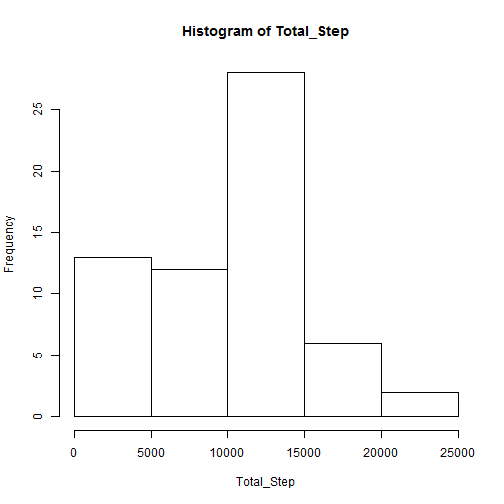
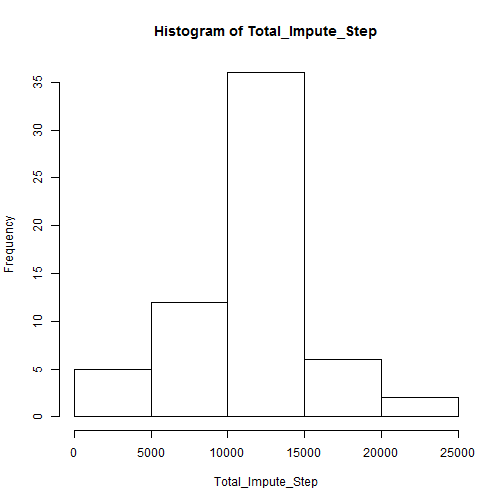

##Loading and preprocessing the data
###Load the CSV file and convert the date to the appropritate Date format

```r
setwd("C:\\Users\\Said\\Google Drive\\PC\\Education\\Coursera\\Data Science\\Study Materials\\05 Reproducible Research\\Week2\\Assignment")
Data <- read.csv("activity.csv")
Data$date <- as.Date(Data$date, format = "%Y-%m-%d")
```

##What is mean total number of steps taken per day?
### 1. Calculate the total number of steps taken per day

```r
Total_Step <- tapply(Data$steps, Data$date, FUN=sum, na.rm=TRUE)
```

### 2. Make a histogram of the total number of steps taken each day

```r
hist(Total_Step)
```



### 3. Mean and median number of steps taken each day

```r
Mean_Step <- mean(Total_Step, na.rm = TRUE)
Mean_Step
```

```
## [1] 9354.23
```

```r
Median_Step <- median(Total_Step, na.rm = TRUE)
Median_Step
```

```
## [1] 10395
```

##What is the average daily activity pattern?
### 1. Time series plot of the average number of steps taken

```r
Step_Interval <- aggregate(x=list(steps = Data$steps), by  = list(interval = Data$interval), FUN=mean, na.rm=TRUE)
plot (Step_Interval, type="l")
```


### 2. Which 5-minute interval, on average across all the days in the dataset, contains the maximum number of steps?

```r
Step_Interval[which.max(Step_Interval$steps),]
```

```
##     interval    steps
## 104      835 206.1698
```

## Imputing missing values
### 1. Calculate and report the total number of missing values in the dataset (i.e. the total number of rows with NAs)

```r
NA_Data <- is.na(Data$steps)
sum(NA_Data)
```

```
## [1] 2304
```

### 2. Devise a strategy for filling in all of the missing values in the dataset. The strategy does not need to be sophisticated. For example, you could use the mean/median for that day, or the mean for that 5-minute interval, etc

```r
Step_Interval_DF <- as.data.frame(Step_Interval)
NewData <- merge (Data,Step_Interval_DF, by = "interval")
```

### 3. Create a new dataset that is equal to the original dataset but with the missing data filled in.

```r
NewData$steps.x[is.na(NewData$steps.x)] = NewData$steps.y[is.na(NewData$steps.x)]
```

### 4. Make a histogram of the total number of steps taken each day and Calculate and report the mean and median total number of steps taken per day

```r
Total_Impute_Step <- tapply(NewData$steps.x, NewData$date, FUN=sum, na.rm=TRUE)
hist(Total_Impute_Step)
```



```r
Mean_Impute_Step <- mean(Total_Impute_Step, na.rm = TRUE)
Mean_Impute_Step
```

```
## [1] 10766.19
```

```r
Median_Impute_Step <- median(Total_Impute_Step, na.rm = TRUE)
Median_Impute_Step
```

```
## [1] 10766.19
```
The values of Mean and Median increase after imputing the missing value. Mean and Median value increases when the missing values are filled up with more large numbers.

## Are there differences in activity patterns between weekdays and weekends?

## 1. Create a new factor variable in the dataset with two levels - "weekday" and "weekend" indicating whether a given date is a weekday or weekend day.

```r
NewData$day <- weekdays(NewData$date)
NewData$day[NewData$day=="Monday"|NewData$day=="Tuesday"|NewData$day=="Wednesday"|NewData$day=="Thursday"|NewData$day=="Friday"] <- "Weekday"
NewData$day[NewData$day=="Saturday"|NewData$day=="Sunday"] <- "Weekend"
```

## 2. Make a panel plot containing a time series plot (i.e. type = "l") of the 5-minute interval (x-axis) and the average number of steps taken, averaged across all weekday days or weekend days (y-axis)  

```r
library(ggplot2)
Step_Interval_Weekday <- aggregate(steps.x ~ interval + day, data = NewData, mean)
ggplot(Step_Interval_Weekday, aes(interval, steps.x)) + geom_line() + facet_grid(day ~ .) + 
   ylab("Steps")
```


